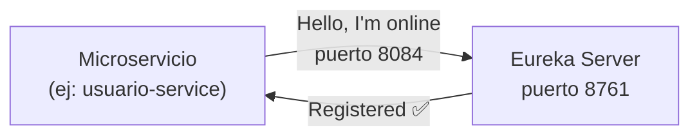
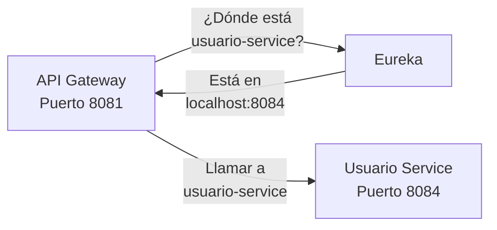

# 🎪 Eureka Server - Servidor de Descubrimiento de Servicios

## 📋 Descripción General

**Eureka Server** es el componente de infraestructura central que actúa como el **registro dinámico** de todos los microservicios en la arquitectura distribuida.

**Puerto:** `8761`  
**Dashboard:** http://localhost:8761  
**Responsabilidad:** Service Discovery (Descubrimiento de Servicios)

---

## 🏗️ Función Principal

Eureka implementa el patrón **Service Discovery** que permite que los microservicios se descubran y comuniquen entre sí dinámicamente sin necesidad de URLs hardcodeadas.

### ¿Por qué es necesario?

```
Sin Eureka:
┌─────────────┐     hardcoded     ┌──────────────┐
│  API Gateway├─────IP:8084───────► Usuario Service
└─────────────┘                    └──────────────┘
             ❌ Frágil y difícil de mantener

Con Eureka:
┌─────────────┐                  ┌──────────────┐
│  API Gateway├──┐   Preguntar   │ Eureka Server│
└─────────────┘  └──────────────► (Dónde está   │
                                  │Usuario Srv?) │
                                  └───────┬──────┘
                                          │Respuesta
                                          │IP:8084
                                  ┌───────▼──────┐
                                  │Usuario Service│
                                  └──────────────┘
             ✅ Dinámico y escalable
```

---

## 🎯 Arquitectura

```
eureka-server/
├── src/main/java/com/distribuidos/eureka_server/
│   └── EurekaServerApplication.java         (Clase principal)
└── src/main/resources/
    └── application.yaml
```

---

## 🔐 Configuración

### application.yaml
```yaml
server:
  port: 8761

spring:
  application:
    name: eureka-server

eureka:
  client:
    register-with-eureka: false        # No se registra a sí mismo
    fetch-registry: false              # No obtiene el registro
  server:
    enable-self-preservation: true     # Protege contra falsos positivos
    eviction-interval-timer-in-ms: 60000
```

### Por qué estas configuraciones:
- **register-with-eureka: false** → Eureka NO se registra a sí mismo (sería circular)
- **fetch-registry: false** → Eureka NO necesita obtener el registro
- **enable-self-preservation** → Sigue registrando servicios aunque se pierdan heartbeats temporales

---

## 📡 Flujo de Funcionamiento

### 1️⃣ **Startup de Microservicio**


### 2️⃣ **Latido Cardiovascular (Heartbeat)**
```
Cada 30 segundos:
usuario-service → "¿Aún estoy vivo?" → Eureka
Eureka → "Sí, todo bien ✅" → usuario-service
```

### 3️⃣ **Descubrimiento**


### 4️⃣ **Shutdown Limpio**
```
Microservicio se apaga → Avisa a Eureka → Eureka lo desregistra
```

---

## 🎪 Dashboard Web

### Acceso
```
http://localhost:8761
```

### Información Mostrada
- ✅ Instancias registradas (count)
- ✅ Lista de servicios activos
- ✅ Información de cada instancia:
  - Nombre del servicio
  - Hostname
  - IP address
  - Puerto
  - Status (UP / DOWN)
  - Último heartbeat

### Ejemplo de Dashboard
```
==APPLICATION==

Instances currently registered with Eureka

Application          Instances
───────────────────────────────────────────
API-GATEWAY          1 instances
  [IP:8081]          UP (1) - ip

USUARIO-SERVICE      1 instances  
  [IP:8084]          UP (1) - ip

EUREKA-SERVER        1 instances
  [IP:8761]          UP (1) - ip

PROVEEDOR-SERVICE    1 instances
  [IP:8086]          UP (1) - ip

CONTRATO-SERVICE     1 instances
  [IP:8087]          UP (1) - ip

AUDIT-SERVICE        1 instances
  [IP:8085]          UP (1) - ip
```

---

## 🚀 Despliegue

### Build
```bash
cd eureka-server
mvn clean package -DskipTests
```

### Ejecutar
```bash
# Opción 1: Maven
mvn spring-boot:run

# Opción 2: Java JAR
java -jar target/eureka-server-1.0.0.jar

# Opción 3: Docker
docker build -t eureka-server:1.0 .
docker run -p 8761:8761 eureka-server:1.0
```

---

## 📊 Registros Esperados

### Al iniciar Eureka
```log
INFO : Initializing Eureka in region us-east-1
INFO : Eureka Server started in: 245ms
INFO : Ready to serve requests.
INFO : Server started on port: 8761
```

### Cuando se registra un microservicio
```log
INFO : Registering instance usuario-service with status UP
INFO : usuario-service registered with status UP
```

---

## 🔗 Integración con Otros Servicios

### Clientes Eureka (que se registran)
```
1. API Gateway (8081)
2. Usuario Service (8084)
3. Proveedor Service (8086)
4. Contrato Service (8087)
5. Audit Service (8085)
```

### Cómo se registran
En `application.yaml` de cada servicio:
```yaml
eureka:
  client:
    service-url:
      defaultZone: http://localhost:8761/eureka/
    register-with-eureka: true        ✅ Sí se registra
    fetch-registry: true              ✅ Obtiene registro
```

---

## ⚠️ Problemas Comunes y Soluciones

### Problema 1: Servicio se muestra como DOWN
```
Causa: No se reciben heartbeats
Solución: 
- Verificar que el servicio está corriendo
- Revisar conectividad de red
- Reiniciar el servicio
```

### Problema 2: API Gateway no encuentra servicios
```
Causa: Eureka no está corriendo
Solución:
- Iniciar Eureka: java -jar eureka-server.jar
- Esperar 2-3 segundos
- Reintentar llamada
```

### Problema 3: Tarda mucho en registrarse
```
Causa: Por defecto tarda ~30 segundos
Solución: Esperado, es por diseño de heartbeats
Ajustar si es necesario en application.yaml
```

---

## 📈 Monitoring y Health

### Health Endpoint
```http
GET http://localhost:8761/actuator/health
```

### Métricas
```http
GET http://localhost:8761/actuator/metrics
```

---

## 🔐 Consideraciones de Seguridad

### En Producción
- ❌ NO exponer Eureka directamente a internet
- ✅ Colocar detrás de firewall
- ✅ Implementar autenticación básica
- ✅ Usar HTTPS para comunicaciones

### Configuración de Seguridad
```yaml
eureka:
  server:
    # Requerir autenticación
    enable-self-preservation: true
    eviction-interval-timer-in-ms: 60000
```

---

## 📝 Logs Importantes

### Log de Startup
```
========================================
✅ EUREKA SERVER INICIADO EXITOSAMENTE
📍 URL del Dashboard: http://localhost:8761
========================================
```

---

## 🛠️ Troubleshooting

### Ver estado de servicios en tiempo real
```bash
curl http://localhost:8761/eureka/apps
```

Respuesta:
```xml
<applications>
  <application>
    <name>USUARIO-SERVICE</name>
    <instance>
      <status>UP</status>
      <ipAddr>192.168.1.100</ipAddr>
      <port>8084</port>
    </instance>
  </application>
  ...
</applications>
```

---

## 🔍 Detalles Técnicos

### Lease Configuration
```yaml
instance:
  lease-renewal-interval-in-seconds: 30      # Heartbeat cada 30s
  lease-expiration-duration-in-seconds: 90   # Expira en 90s sin heartbeat
```

### Eviction Policy
- Si un servicio no envía heartbeat por 90 segundos, se desregistra
- **Self-Preservation Mode** previene desregistros falsos en caso de problemas de red

---

## 🚨 Estados de Instancia

```
UP           → Servicio está corriendo y sano
DOWN         → Servicio no responde a health checks
OUT_OF_SERVICE → Registrado pero no debe recibir tráfico
UNKNOWN      → Estado desconocido
```

---

## 📚 Referencias

- [Eureka wiki](https://github.com/Netflix/eureka/wiki)
- [Spring Cloud Eureka](https://cloud.spring.io/spring-cloud-eureka/)
- [Microservices with Spring Cloud](https://spring.io/guides)

---

## 👨‍💻 Desarrollador Responsable

**Dev1 - Infraestructura**
- Lina Xiomara Ladino Fernández
- Revisor: Sebastian Perez (Arquitecto Senior)

---

## ✅ Checklist de Verificación

- ✅ Eureka Server inicia en puerto 8761
- ✅ Dashboard accesible en http://localhost:8761
- ✅ Todos los 5 microservicios registrados y UP
- ✅ API Gateway puede resolver nombres de servicio
- ✅ Heartbeats activos cada 30 segundos
- ✅ Logging correcto en consola

---

**Última actualización:** 26 de Abril de 2026  
**Versión:** 1.0  
**Estado:** ✅ Production Ready
